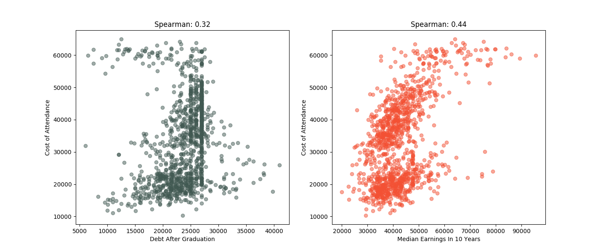

# College Scorecard Data Analysis

This project aims to shed some insights into the performance of colleges by looking at Department of Education Data primary the College Scorecard. You can check out more information about the dataset by got to [College Scorecard Data](https://collegescorecard.ed.gov/data/).  My hope is that you can fork this repo and run more analysis in the data.  If you do so, the only request that I have is that you try to share your analysis.

# Running the application

**Mac OSX pre-requisites**

* Install Python
```
$ brew install python3
```
* Install Virtualenv
```
$ pip install virtualenv
```

**Step 1: Clone the git repo**
```
$ git clone https://github.com/erwindev/college-scorecard-data.git  
```

**Step 2: Create the virtual environment.**  
```
$ virtualenv -p /usr/local/bin/python3 venv
$ source venv/bin/activate
```
**Step 3: Install the modules**
```
$ pip install -r requirements.txt
```
**Step 4: Run the application**
```
$ python college_score_card.py
```

# Required modules
```
pandas
matplotlip
scipy
numpy
```
** Doing a pip install of requirements.txt will install all of this.
** Also, I've had issues running it within a virtual environment.  You might need to pip install matplotlib globally.  

# Understanding the data
I downloaded the necessary files to run various analysis on the College Scorecard data.  In order to understand the data, you will need the CollegeScorecardDataDictionary.xslx file.  That "data_dictionary" sheet on that file contains all the description of the data found in the following files MERGED2014_15_PP.csv, Most-Recent-Cohorts-Scorecard-Elements.csv and Most-Recent-Cohorts-Treasury-Elements.csv.

# Some of my analysis

* Correlation between Admission Rate and 10 Year Median Earning 
There is a negative correlation between Admission Rate of a school and Median Earning in 10 years of its graduates. 

* Correlation between Cost of Attendance and Student Debt and Median Earning in 10 years


# Questions
Talk to:

* Erwin Alberto
